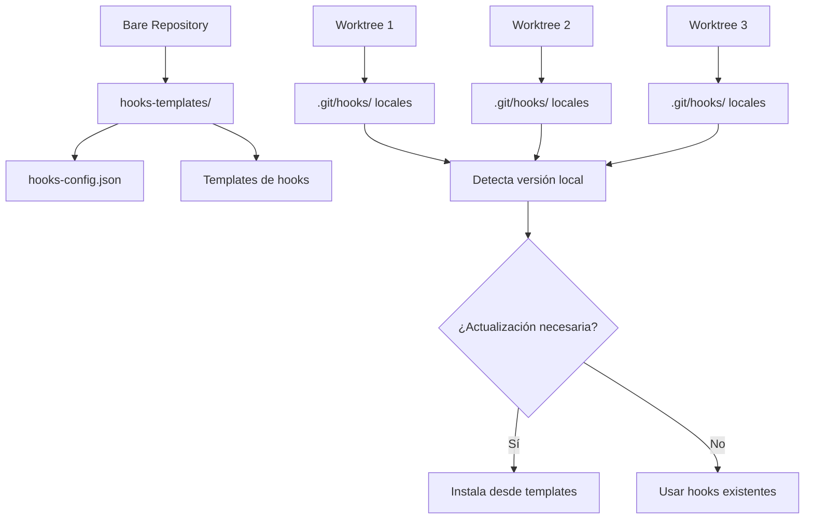
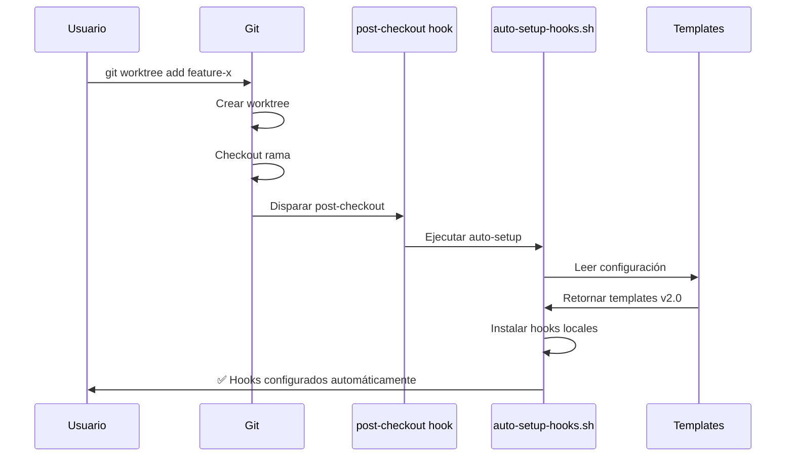

# Implementación de Git Hooks Compatible con Worktrees

## Contexto del Problema

El workspace actual usa un sistema de **bare repository + worktrees múltiples**:

```
quixotic-workspace/
├── .git/ (bare repository)
├── hooks-templates/ (hooks centralizados - NUEVO)
├── scripts/ (scripts compartidos)
├── main/ (worktree principal)
├── feature-better-cursor-rules/ (worktree actual)
├── feature-mobile-support/ (worktree)
└── develop/ (worktree)
```

### Desafíos Identificados

1. **Hooks fragmentados**: Cada worktree tiene hooks independientes
2. **Versionado de hooks**: Diferentes ramas pueden necesitar versiones diferentes
3. **Sincronización**: Git no maneja automáticamente hooks en worktrees
4. **Compatibilidad**: Debe funcionar en Linux, macOS y Windows

## Solución Propuesta: Sistema Híbrido

### Arquitectura del Sistema



## PARTE 1: Tareas en esta Rama (feature/better-cursor-rules)

### 1.1 Modificar Script Actual

**Archivo a modificar**: `scripts/setup-git-hooks.sh`

**Cambios necesarios**:

```bash
# Función para detectar si estamos en worktree
detect_worktree_environment() {
    local git_common_dir
    git_common_dir=$(git rev-parse --git-common-dir 2>/dev/null || echo "")
    
    if [[ -n "$git_common_dir" ]] && [[ "$git_common_dir" != ".git" ]]; then
        echo "worktree"
        return 0
    else
        echo "standalone"
        return 1
    fi
}

# Función para encontrar directorio templates
find_hooks_templates_dir() {
    local git_common_dir
    git_common_dir=$(git rev-parse --git-common-dir 2>/dev/null)
    
    if [[ -n "$git_common_dir" ]]; then
        # En worktree, buscar en el bare repo
        local templates_dir="$git_common_dir/../hooks-templates"
        if [[ -d "$templates_dir" ]]; then
            echo "$templates_dir"
            return 0
        fi
    fi
    
    # Fallback: buscar en directorio actual
    if [[ -d "hooks-templates" ]]; then
        echo "hooks-templates"
        return 0
    fi
    
    return 1
}
```

### 1.2 Crear Sistema de Versionado

**Nuevo archivo**: `scripts/hooks-config.json`

```json
{
  "version": "2.0",
  "description": "QuixoticWhisper Git Hooks v2.0",
  "required_scripts": [
    "generate-claude-context.sh",
    "validate-claude-context.sh", 
    "validate-cursor-rules.sh"
  ],
  "hooks": {
    "pre-commit": {
      "template": "pre-commit.template",
      "description": "Auto-regenera CLAUDE.md en cambios de reglas"
    },
    "post-checkout": {
      "template": "post-checkout.template", 
      "description": "Auto-setup de hooks en nuevos worktrees"
    },
    "pre-push": {
      "template": "pre-push.template",
      "description": "Validación final antes de push"
    }
  }
}
```

### 1.3 Templates de Hooks Inteligentes

**Nuevo directorio**: `hooks-templates/`

**Template base para auto-detección**:

```bash
#!/bin/bash
# Template base para hooks con auto-detección de entorno

# Auto-detectar si estamos en worktree o standalone
SCRIPT_ROOT=""
if git rev-parse --git-common-dir >/dev/null 2>&1; then
    GIT_COMMON_DIR=$(git rev-parse --git-common-dir)
    if [[ "$GIT_COMMON_DIR" != ".git" ]]; then
        # Estamos en worktree
        SCRIPT_ROOT="$GIT_COMMON_DIR/../scripts"
    else
        # Repositorio standalone
        SCRIPT_ROOT="./scripts"
    fi
else
    SCRIPT_ROOT="./scripts"
fi

# Verificar que los scripts existan
if [[ ! -d "$SCRIPT_ROOT" ]]; then
    echo "❌ Error: Directorio de scripts no encontrado en $SCRIPT_ROOT"
    exit 1
fi

# [LÓGICA ESPECÍFICA DEL HOOK AQUÍ]
```

### 1.4 Actualizar Auto-setup

**Modificar**: `scripts/auto-setup-hooks.sh`

```bash
# Detectar entorno y configurar apropiadamente
ENVIRONMENT=$(detect_worktree_environment)
TEMPLATES_DIR=$(find_hooks_templates_dir)

if [[ -z "$TEMPLATES_DIR" ]]; then
    # Modo degradado: usar hooks embebidos en script
    echo "⚠️ Templates no encontrados, usando hooks embebidos"
    setup_embedded_hooks
else
    # Modo completo: usar templates versionados
    echo "✅ Usando templates desde $TEMPLATES_DIR"
    setup_versioned_hooks "$TEMPLATES_DIR"
fi
```

## PARTE 2: Tareas en Workspace Base (Bare Repository)

### 2.1 Estructura de Directorios

**Crear en el directorio raíz del workspace**:

```bash
quixotic-workspace/
├── .git/ (bare repository)
├── hooks-templates/           # NUEVO
│   ├── hooks-config.json     # Configuración versionada
│   ├── pre-commit.template   # Template de pre-commit
│   ├── post-checkout.template # Template de post-checkout  
│   ├── pre-push.template     # Template de pre-push
│   └── commit-msg.template   # Template de commit-msg
├── scripts/                  # Mover aquí desde worktrees
│   ├── setup-git-hooks.sh
│   ├── auto-setup-hooks.sh
│   ├── generate-claude-context.sh
│   └── validate-claude-context.sh
└── [worktrees individuales]
```

### 2.2 Comandos de Setup Inicial

**En el directorio raíz del workspace**:

```bash
# 1. Crear estructura de templates
mkdir -p hooks-templates

# 2. Mover scripts comunes (ejecutar desde worktree existente)
cp -r scripts/* ../scripts/ 

# 3. Configurar git para usar templates globalmente (opcional)
git config --global init.templatedir "$(pwd)/hooks-templates"

# 4. Crear configuración central
cat > hooks-templates/hooks-config.json << 'EOF'
{
  "version": "2.0",
  "workspace_type": "bare_with_worktrees",
  "auto_setup": true
}
EOF
```

### 2.3 Actualización de Worktrees Existentes

**Para cada worktree existente**:

```bash
# Desde cada worktree
cd main/  # o feature-x/
./scripts/setup-git-hooks.sh --upgrade-from-templates

# El script detectará automáticamente:
# - Que está en un worktree
# - Ubicación de templates en ../hooks-templates
# - Versión actual vs requerida
# - Instalará hooks actualizados
```

## Flujo de Trabajo: Crear Nuevo Worktree

### Comando Manual Completo

```bash
# Desde directorio raíz del workspace
git worktree add feature-new-feature origin/main

# Los hooks se instalan automáticamente via post-checkout
cd feature-new-feature/

# Verificar instalación
ls -la .git/hooks/
cat .git/hooks/.quixotic-hooks-installed
```

### Flujo Automático



## Ventajas de esta Solución

### ✅ **Ventajas Técnicas**

1. **Versionado granular**: Cada worktree puede usar la versión de hooks apropiada
2. **Instalación automática**: post-checkout instala hooks al crear worktrees
3. **Compatibilidad**: Funciona con standalone repos y worktrees
4. **Rollback seguro**: Fácil volver a versiones anteriores

### ✅ **Ventajas Operacionales**

1. **Cero configuración manual**: Setup automático transparente
2. **Sincronización inteligente**: Solo actualiza cuando es necesario
3. **Troubleshooting simple**: Logs claros y estados verificables
4. **Multiplataforma**: Linux, macOS, Windows

## Casos de Uso Cubiertos

### Caso 1: Desarrollador Nuevo
```bash
git clone [bare-repo-url] workspace
cd workspace
git worktree add main origin/main
cd main
# ✅ Hooks instalados automáticamente
```

### Caso 2: Rama con Hooks Diferentes
```bash
git worktree add legacy-support legacy-branch
cd legacy-support
# ✅ Instala hooks v1.0 (según config en esa rama)
```

### Caso 3: Actualización de Hooks
```bash
# En cualquier worktree
git pull origin main  # Actualiza templates
# ✅ post-merge detecta cambios y sugiere actualización
```

### Caso 4: Troubleshooting
```bash
# Verificar estado de hooks
./scripts/setup-git-hooks.sh --status

# Reinstalar forzado
./scripts/setup-git-hooks.sh --force

# Modo debug
./scripts/setup-git-hooks.sh --debug
```

## Cronograma de Implementación

### Fase 1: Esta Rama (1-2 días)
- [ ] Modificar setup-git-hooks.sh con detección de worktree
- [ ] Crear sistema de templates versionados
- [ ] Actualizar auto-setup-hooks.sh
- [ ] Testing en worktree actual

### Fase 2: Workspace Base (1 día)
- [ ] Crear estructura hooks-templates/
- [ ] Mover scripts a ubicación central
- [ ] Configurar git global settings
- [ ] Actualizar worktrees existentes

### Fase 3: Validación (1 día)
- [ ] Crear nuevo worktree desde cero
- [ ] Verificar instalación automática
- [ ] Testing de casos edge
- [ ] Documentación final

## Consideraciones de Mantenimiento

### Actualización de Templates
```bash
# Para actualizar templates en todos los worktrees:
./scripts/update-all-worktree-hooks.sh

# Para actualizar solo un worktree:
cd specific-worktree/
./scripts/setup-git-hooks.sh --update
```

### Monitoring
```bash
# Script para verificar estado de todos los worktrees
./scripts/check-worktree-hooks-status.sh

# Output esperado:
# ✅ main: hooks v2.0 (actualizado)
# ⚠️  feature-old: hooks v1.0 (desactualizado)
# ❌ feature-broken: hooks no instalados
```

Esta implementación proporciona un sistema robusto, versionado y automático para manejar Git hooks en un entorno de worktrees múltiples. 