# Sistema de Git Hooks Versionados por Rama

## Concepto Central

**Hooks viven dentro de cada rama** y se auto-instalan en checkout. Sin fuente de verdad única, sin sincronización externa.

### Principio Fundamental
```
git checkout branch-x → hooks de branch-x se instalan automáticamente
```

## Arquitectura del Sistema

### 📁 Estructura por Modo de Trabajo

#### **Repo Standalone:**
```
QuixoticWhisper/
├── .githooks/              # Hooks versionados (parte del código)
│   ├── config.json        # Configuración de hooks
│   ├── scripts/
│   │   ├── windows/       # Scripts específicos Windows
│   │   ├── linux/         # Scripts específicos Linux
│   │   ├── macos/         # Scripts específicos macOS
│   │   └── common/        # Scripts multiplataforma
│   └── templates/
│       ├── pre-commit
│       ├── post-checkout
│       └── platform-resolver
├── .git/                  # Directorio Git normal
│   └── hooks/             # ← Hooks instalados aquí
│       ├── pre-commit     # Instalado automáticamente
│       ├── post-checkout  # Instalado automáticamente
│       └── .hook-metadata # Versión instalada + timestamp
└── src/                   # Código del proyecto
```

#### **Workspace con Bare Repo + Worktrees (Detallado):**
```
quixotic-workspace/
├── QuixoticWhisper.git/                # Repositorio Bare (central)
│   └── worktrees/                      # Metadata de cada worktree
│       ├── main/
│       │   ├── hooks/                  # ← Hooks para el worktree 'main'
│       │   └── config.worktree         # ← Config específica del worktree
│       └── feature-x/
│           ├── hooks/                  # ← Hooks para el work-tree 'feature-x'
│           └── config.worktree         # ← Contiene p.ej. 'hooksPath'
├── main/                               # Worktree principal
│   ├── .git                            # Archivo de texto, no directorio
│   ├── .githooks/                      # Hooks versionados (rama main)
│   └── src/
└── feature-x/                          # Worktree para una feature
    ├── .git                            # Contenido: gitdir: ../QuixoticWhisper.git/worktrees/feature-x
    ├── .githooks/                      # Hooks versionados (rama feature-x)
    └── src/
```

#### **Componentes Clave en Worktrees**

- **`feature-x/.git` (Archivo)**: A diferencia de un repo standalone, esto no es una carpeta. Es un simple archivo de texto que le dice a Git dónde encontrar la metadata real. Su contenido es una línea: `gitdir: ../QuixoticWhisper.git/worktrees/feature-x`.

- **`QuixoticWhisper.git/worktrees/feature-x/config.worktree`**: Este archivo contiene la configuración específica para el worktree `feature-x`. Una de las líneas más importantes que puede contener es `hooksPath`, que le dice a Git que debe ejecutar los hooks desde su propio directorio (`.../worktrees/feature-x/hooks/`) en lugar de usar los hooks globales del repositorio bare. La directiva `bare = false` confirma que este es un directorio de trabajo con archivos físicos.

### 🔄 Algoritmo de Instalación Universal

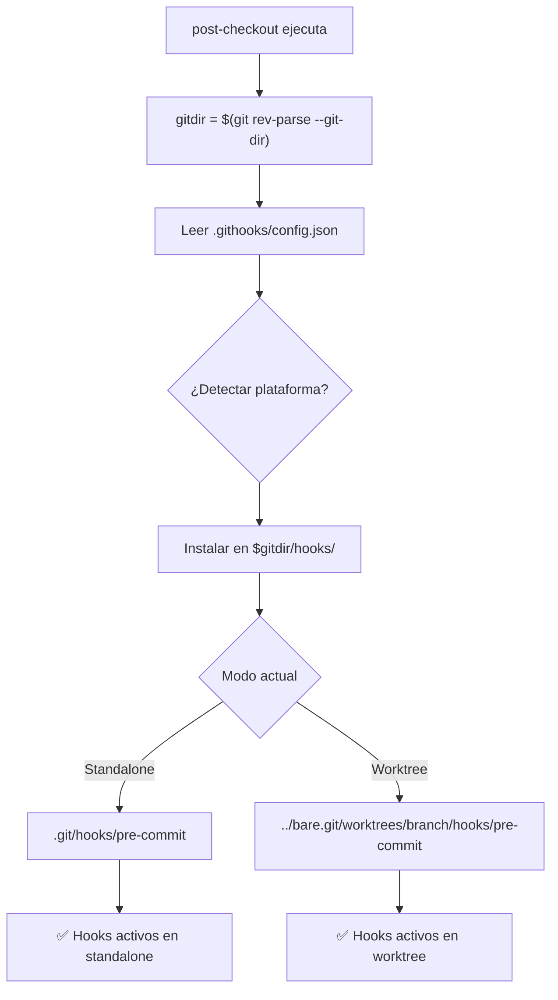

### 🎯 Ubicaciones de Instalación por Modo

| Modo | Comando Detección | Hooks Fuente | Hooks Instalados | Resultado |
|------|-------------------|--------------|------------------|-----------|
| **Standalone** | `git rev-parse --git-dir` → `.git` | `./githooks/` | `.git/hooks/` | Instalación local |
| **Worktree** | `git rev-parse --git-dir` → `../bare.git/worktrees/branch` | `./githooks/` | `$gitdir/hooks/` | Instalación aislada en metadata del worktree |

## Compatibilidad Dual: Standalone vs Worktrees

### 🎯 Comportamiento Idéntico por Comando

| Operación | Standalone | Worktrees | Mecanismo |
|-----------|------------|-----------|-----------|
| **Instalación Inicial** | `./.githooks/install.sh` | `./.githooks/install.sh` | Script de arranque único |
| `git checkout main` | Instala hooks de main en `.git/hooks/` | Instala hooks de main en `$gitdir/hooks/` | `git rev-parse --git-dir` |
| `git checkout feature-x` | Instala hooks de feature-x en `.git/hooks/` | Instala hooks de feature-x en `$gitdir/hooks/` | `git rev-parse --git-dir` |
| Modificar .githooks/ | Commit normal en repo | Commit normal en rama | Git versionado estándar |
| `git merge` | Merge de hooks incluido | Merge de hooks incluido | Git merge estándar |
| **Instalación** | Manual, propenso a errores | Automática con script de arranque | Eliminar scripts manuales y documentar `install.sh` |
| **Platform support** | Solo Linux/Unix | Windows/Linux/macOS | Reescribir scripts |
| **Synchronization** | Manual entre worktrees | Automática por rama | Eliminar sync logic |

### 🔄 Flujo Unificado (Zero Detection Logic)

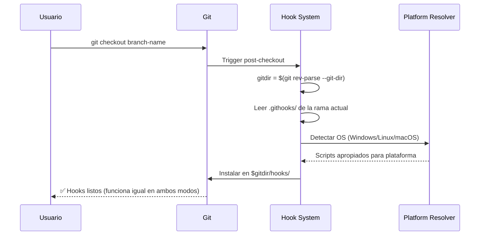

## Gestión de Versiones por Rama

### 📊 Versionado Automático por Merge-Base

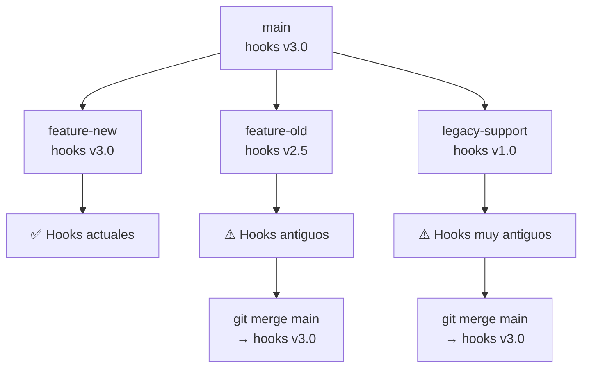

### 🔧 Configuración por Rama

```json
{
  ".githooks/config.json": {
    "version": "3.0.0",
    "platform_support": ["windows", "linux", "macos"],
    "hooks": {
      "pre-commit": {
        "enabled": true,
        "script": "validate-code.{ext}",
        "timeout_ms": 30000
      },
      "post-checkout": {
        "enabled": true, 
        "script": "auto-install-hooks.{ext}"
      }
    },
    "branch_specific": {
      "legacy/*": {
        "hooks.pre-push.enabled": false
      },
      "experimental/*": {
        "hooks.pre-commit.timeout_ms": 60000
      }
    }
  }
}
```

## Flujos de Trabajo Principales

### 🚀 Workflow: Desarrollar Nueva Feature

#### **En Standalone:**
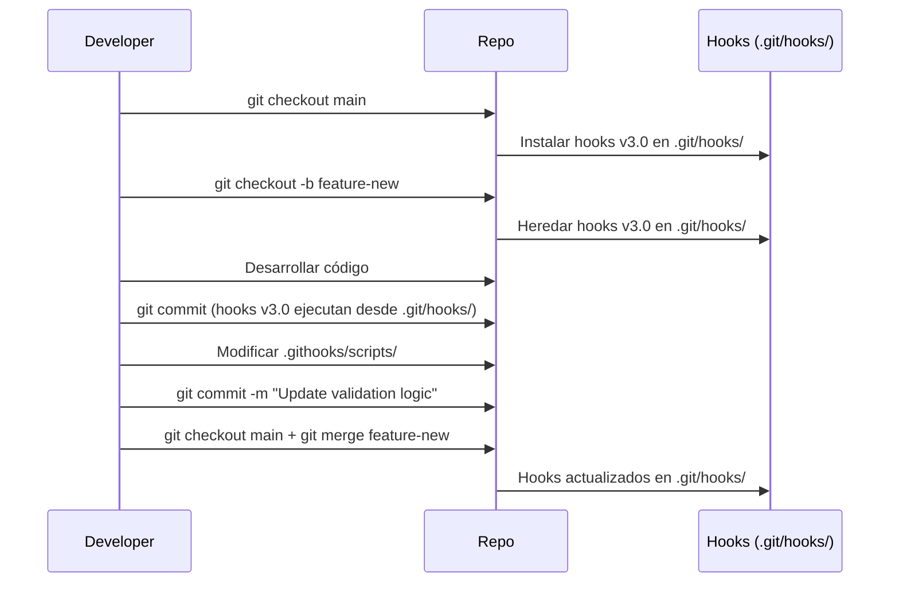

#### **En Workspace:**
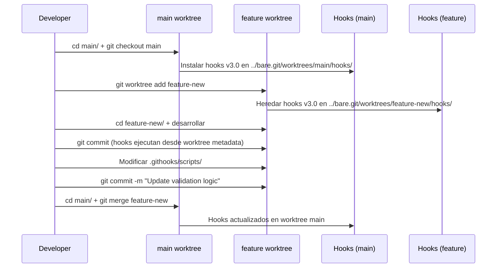

### 🔄 Workflow: Mantener Rama de Larga Duración

#### **En Standalone:**
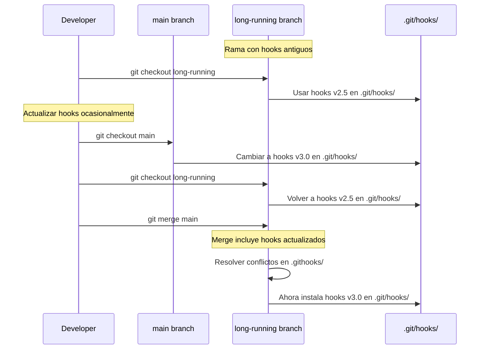

#### **En Workspace:**
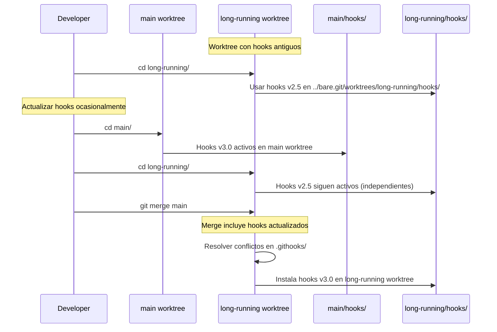

### ⚡ Workflow: Hotfix con Hooks Específicos

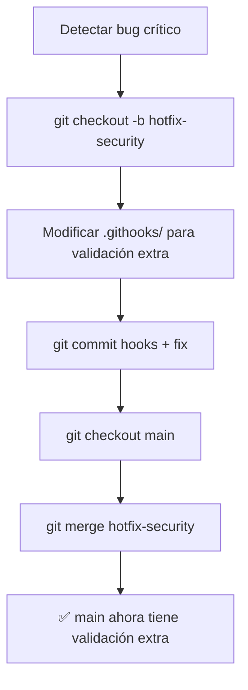

## Aspectos de Diseño y Decisiones

### ✅ Decisiones Clave

| Decisión | Razón | Alternativa Rechazada |
|----------|--------|----------------------|
| **Hooks en cada rama** | Simplicidad + versionado automático | Hooks centralizados |
| **Auto-install en post-checkout** | Transparencia total | Install manual |
| **Platform detection automática** | Zero-config multiplataforma | Config manual por user |
| **Metadata local** | Cache + troubleshooting | Sin tracking de estado |
| **JSON config** | Parsing fácil + legible | YAML/TOML |

### ⚖️ Tradeoffs Principales

| Aspecto | Ventaja | Desventaja | Mitigación |
|---------|---------|------------|------------|
| **Hooks en branches** | Versionado automático | Fragmentación posible | Merge frecuente |
| **Auto-install** | Zero-config | Hooks maliciosos potenciales | Code review |
| **Sin sincronización** | Extrema simplicidad | Inconsistencia temporal | Branch hygiene |
| **Multiplataforma** | Funciona everywhere | Complejidad scripts | Fallbacks |

## Pitfalls y Mitigaciones

### ⚠️ Problemas Anticipados

#### 1. **Merge Conflicts en .githooks/**
**Problema**: Cambios simultáneos en hooks generan conflictos
**Mitigación**: 
- Templates modulares
- Scripts auto-merge para configs
- Documentación de resolución

#### 2. **Hooks Maliciosos en Ramas**
**Problema**: Desarrollador inyecta código malicioso en hooks
**Mitigación**:
- Code review obligatorio para .githooks/
- Whitelist de scripts permitidos
- Hooks read-only para ciertos roles

#### 3. **Ramas Antiguas con Hooks Obsoletos**
**Problema**: Features de larga duración usan validaciones obsoletas
**Mitigación**:
- Warning automático por edad de hooks
- Merge periódico forzado desde main
- Feature flags en lugar de hooks diferentes

#### 4. **Performance en Repos Grandes**
**Problema**: Instalar hooks en cada checkout es lento
**Mitigación**:
- Cache inteligente (solo instalar si cambió)
- Hooks compiled/binarios
- Skip automático si metadata igual

#### 5. **Debugging Complejo**
**Problema**: Difícil saber qué versión de hooks se ejecutó
**Mitigación**:
- Metadata detallada (.hook-metadata)
- Logging de ejecución
- CLI de diagnóstico

### 🔧 Sistema de Diagnóstico

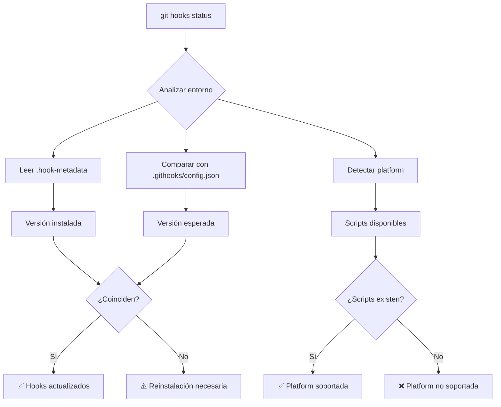

## Plan de Implementación

### 📋 Fases de Desarrollo

#### **Fase 1: Core System**
- [ ] post-checkout auto-installer
- [ ] Platform detection (Windows/Linux/macOS)
- [ ] Template system básico
- [ ] Metadata tracking

#### **Fase 2: Configuration**
- [ ] JSON config parsing
- [ ] Branch-specific overrides
- [ ] Platform-specific script resolution
- [ ] Error handling robusto

#### **Fase 3: Developer Experience**
- [ ] CLI de gestión (git hooks status/install/validate)
- [ ] Troubleshooting tools
- [ ] Documentation completa
- [ ] Migration scripts desde sistema actual

#### **Fase 4: Advanced Features**
- [ ] Hook caching/performance
- [ ] Security validations
- [ ] Integration testing
- [ ] Monitoring/metrics

### 🎯 Resultados Esperados

| Métrica | Objetivo | Medición |
|---------|----------|----------|
| **Setup time** | < 5 segundos | Time desde git checkout |
| **Platform support** | 100% Windows/Linux/macOS | Test matrix |
| **Conflict resolution** | < 2 minutos | Manual merge time |
| **Debug time** | < 1 minuto | Issue identification |
| **Adoption rate** | > 90% | Desarrolladores usando sistema |

## Ventajas Competitivas

### 🚀 vs Sistema Actual
- **90% menos complejidad** de setup
- **100% compatibilidad** standalone/worktrees
- **Cero configuración** para nuevos desarrolladores
- **Versionado automático** por rama

### 🚀 vs Herramientas Externas (Husky, etc.)
- **Sin dependencias** externas
- **Multiplataforma** nativo
- **Integración Git** perfecta
- **Zero-config** experience

### 🚀 vs Hooks Centralizados
- **Flexibilidad** por rama/contexto
- **Simplicidad** extrema
- **Rollback** automático
- **Troubleshooting** trivial

## Migración desde Sistema Actual

### 📊 Estado Actual vs Objetivo

| Aspecto | Sistema Actual | Sistema Objetivo | Acción |
|---------|----------------|------------------|---------|
| **Hooks location** | `scripts/` en worktrees | `.githooks/` en cada rama | Mover y versionizar |
| **Installation** | Manual `setup-git-hooks.sh` | Auto en post-checkout | Eliminar scripts manuales |
| **Platform support** | Solo Linux/Unix | Windows/Linux/macOS | Reescribir scripts |
| **Synchronization** | Manual entre worktrees | Automática por rama | Eliminar sync logic |
| **Configuration** | Hardcoded en scripts | JSON declarativo | Extraer configuración |

### 🔄 Estrategia de Migración

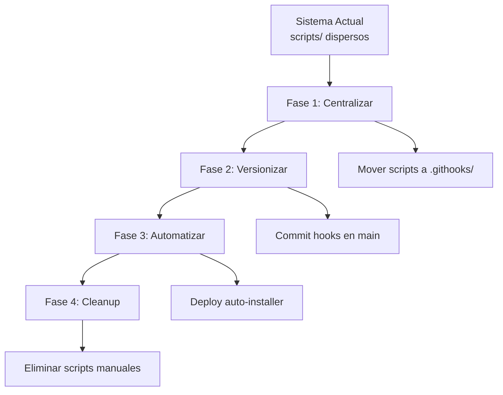

### ⚡ Plan de Migración por Fases

#### **Fase 1: Preparación**

##### **Para Standalone y Workspace:**
```bash
# En QuixoticWhisper/ o quixotic-workspace/main/
mkdir .githooks/{scripts/{windows,linux,macos,common},templates}

# Migrar scripts existentes y crear equivalentes para otras plataformas
# Crear configuración JSON inicial
# Crear el script de arranque .githooks/install.sh
```

#### **Fase 2: Versionado**

##### **Para Standalone:**
```bash
# Commit hooks en repo principal
git add .githooks/
git commit -m "Add versioned git hooks system"
git push origin main
```

##### **Para Workspace:**
```bash
# Commit hooks en main worktree
cd main/
git add .githooks/
git commit -m "Add versioned git hooks system"
git push origin main

# Propagar a otros worktrees
cd ../feature-x/
git merge main  # Obtiene .githooks/
cd ../experimental-y/
git merge main  # Obtiene .githooks/
```

#### **Fase 3: Auto-installer**

##### **Para Standalone y Workspace:**
```bash
# Ejecutar el instalador de arranque único
./.githooks/install.sh

# Verificar funcionamiento: el comando anterior ya debe haber instalado los hooks
# y ejecutado el post-checkout.
git checkout main  # Debe reportar que los hooks ya están instalados o actualizarlos.
```

#### **Fase 4: Cleanup**
```bash
# Eliminar scripts manuales obsoletos
rm scripts/setup-git-hooks.sh
rm scripts/auto-setup-hooks.sh
git commit -m "Remove manual hook scripts"
```

### 🎯 Mapping de Componentes

#### Scripts Existentes → Nuevos Componentes

| Script Actual | Nuevo Componente | Cambio |
|---------------|------------------|---------|
| `generate-claude-context.sh` | `.githooks/scripts/linux/generate-claude-context.sh` | Mover + duplicar para Windows |
| `validate-claude-context.sh` | `.githooks/scripts/common/validate-claude-context.js` | Reescribir en Node.js |
| `validate-cursor-rules.sh` | `.githooks/scripts/linux/validate-cursor-rules.sh` | Mover + crear Windows version |
| `setup-git-hooks.sh` | `.githooks/templates/post-checkout` | Lógica integrada |
| `auto-setup-hooks.sh` | **ELIMINAR** | Reemplazado por auto-install |

#### Configuración Manual → JSON Declarativo

```json
{
  "config_migration": {
    "from": "scripts/setup-git-hooks.sh hardcoded logic",
    "to": ".githooks/config.json",
    "mappings": {
      "HOOK_LIST": "hooks.*.enabled",
      "PLATFORM_DETECTION": "platform_support[]",
      "SCRIPT_PATHS": "hooks.*.script",
      "VALIDATION_LOGIC": "hooks.*.validation"
    }
  }
}
```

### 📋 Checklist de Migración

#### **Pre-migración**
- [ ] Backup completo del workspace actual
- [ ] Inventario de scripts existentes por worktree
- [ ] Identificar dependencias hardcoded
- [ ] Documentar comportamiento actual

#### **Durante migración**
- [ ] Crear .githooks/ structure en main
- [ ] Migrar scripts manteniendo funcionalidad
- [ ] Crear scripts Windows equivalentes
- [ ] Testear auto-installer en worktree test
- [ ] Validar multiplataforma

#### **Post-migración**
- [ ] Verificar todos los worktrees funcionen
- [ ] Eliminar scripts manuales obsoletos
- [ ] Actualizar documentación del workspace
- [ ] Training team sobre nuevo sistema

### ⚠️ Riesgos de Migración

| Riesgo | Impacto | Mitigación |
|--------|---------|------------|
| **Scripts incompatibles** | Hooks no funcionan | Testear exhaustivamente antes |
| **Worktrees inconsistentes** | Algunos sin hooks | Rollout gradual por worktree |
| **Dependencias rotas** | Build/deploy falla | Mantener scripts viejos temporalmente |
| **Resistencia del equipo** | Adopción lenta | Documentación + training |

### 🔧 Comandos de Migración por Modo

#### **Para Standalone:**
```bash
# Verificar estado pre-migración
./scripts/setup-git-hooks.sh --status  # Sistema actual

# Después de migración
git hooks status                       # Sistema nuevo (hooks en .git/hooks/)
git hooks validate --migration         # Verificar equivalencia

# Comparar comportamiento
git hooks test --compare-with-legacy    # A/B testing
```

#### **Para Workspace:**
```bash
# Verificar estado pre-migración (desde cualquier worktree)
./scripts/setup-git-hooks.sh --status  # Sistema actual

# Después de migración
git hooks status                       # Sistema nuevo (hooks en $gitdir/hooks/)
git hooks status --all-worktrees       # Estado de todos los worktrees
git hooks validate --workspace         # Verificar consistencia del workspace

# Comparar comportamiento
git hooks test --compare-with-legacy    # A/B testing por worktree
```

### 📊 Validación de Migración por Modo

#### **Standalone:**
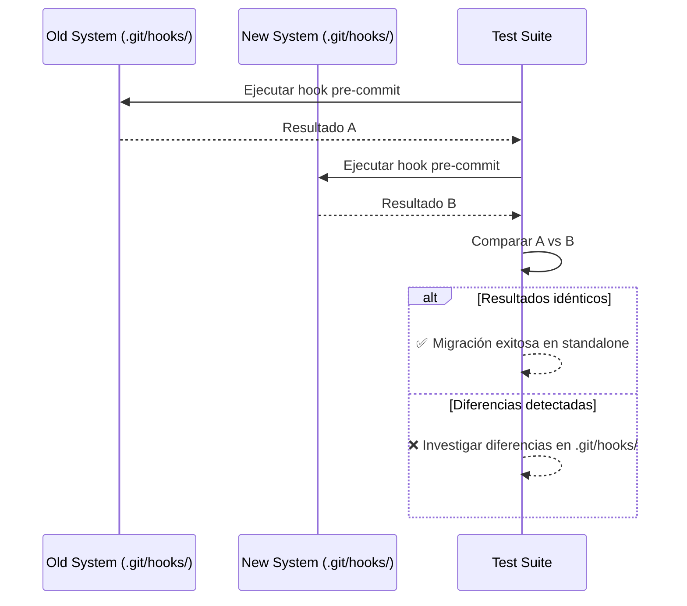

#### **Workspace:**
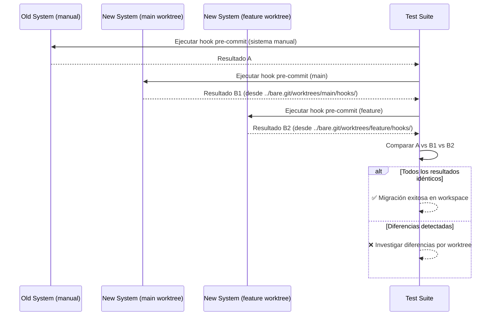

### 🎯 Métricas de Éxito

| Métrica | Baseline (Actual) | Target (Nuevo) | Medición |
|---------|-------------------|----------------|----------|
| **Setup time** | ~5 minutos manual | < 10 segundos auto | Tiempo de checkout |
| **Platform coverage** | Linux only | Windows/Linux/macOS | Test matrix |
| **Error rate** | ~15% setup failures | < 1% failures | Error tracking |
| **Developer satisfaction** | Manual setup frustration | Zero-config happiness | Survey |

Este sistema elimina la complejidad de sincronización a cambio de gestión distribuida de hooks, optimizando para simplicidad y developer experience.