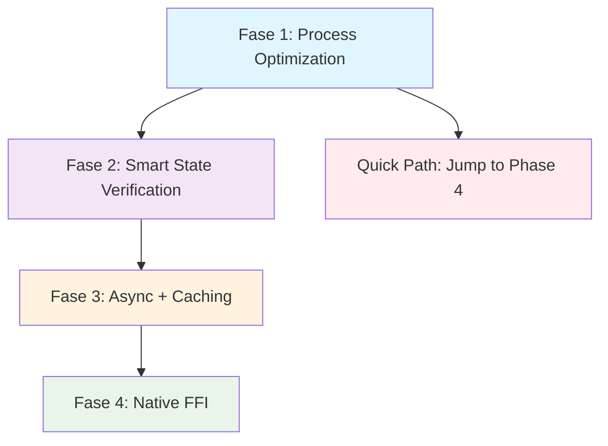
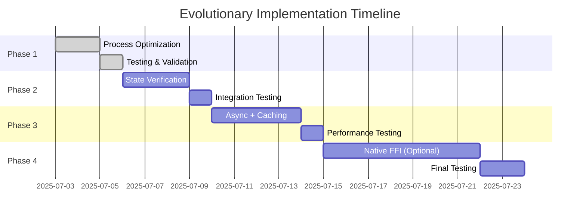
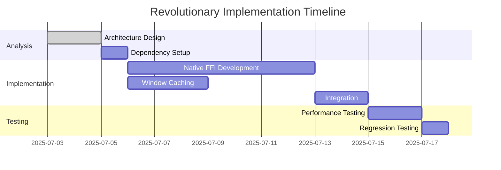

# Linux Paste Optimization - Análisis y Propuesta Técnica

**Fecha**: 2025-07-02  
**Estado**: Análisis técnico y propuesta de implementación  
**Objetivo**: Reducir latencia de paste de 1.5s a <250ms  

## Diagnóstico del Problema

### Síntomas Observados
- **Latencia actual**: >1.5 segundos entre clipboard disponible y paste en ventana destino
- **Latencia objetivo**: <250ms (paridad con Mac/Windows)
- **Aplicación**: Flutter Linux en background con hotkeys globales Ubuntu

### Root Cause Analysis - Top 5 Hipótesis

#### 1. **Timing Issues en Window Focus Restoration** 🎯
**Probabilidad: ALTA** | **Impacto: ~400ms**

```dart
// Problema identificado
await Process.run('xdotool', ['windowfocus', originalWindow]);
await Future.delayed(Duration(milliseconds: 150)); // ⚠️ Delay fijo arbitrario
await Process.run('xdotool', ['key', 'ctrl+v']);
await Future.delayed(Duration(milliseconds: 150)); // ⚠️ Más tiempo perdido
```

**Causa**: Delays fijos (300ms total) que no consideran estado real de ventanas.

#### 2. **Process.run() Performance Overhead** ⚡
**Probabilidad: ALTA** | **Impacto: ~300ms**

```dart
// Cada llamada spawns proceso completo
Process.run('xdotool', ['getactivewindow'])      // ~100-200ms
Process.run('xdotool', ['windowfocus', id])      // ~100-200ms  
Process.run('xdotool', ['key', 'ctrl+v'])        // ~100-200ms
```

**Causa**: Overhead acumulativo de múltiples procesos del sistema.

#### 3. **Flutter Main Thread Blocking** 🔄
**Probabilidad: MEDIA-ALTA** | **Impacto: ~200ms**

**Causa**: Operaciones síncronas bloqueando UI thread y queueing.

#### 4. **IPC File System Latency** 📁
**Probabilidad: MEDIA** | **Impacto: ~100ms**

**Causa**: Sistema IPC basado en archivos temporales con latencia I/O.

#### 5. **Cold Start vs Warm Start Inconsistency** 🏃‍♂️
**Probabilidad: MEDIA** | **Impacto: ~300ms**

**Causa**: Flow diferente forzando cold start behaviors innecesariamente.

---

## Arquitectura de Solución

### Estrategia Multi-Fase Compatible

Las fases están diseñadas para ser **evolutivas y compatibles**, no mutuamente excluyentes.



---

## Fase 1: Process Optimization
**Esfuerzo**: Bajo (1-2 días) | **Reducción**: ~400ms | **Compatibilidad**: ✅ Base para todas las fases

### Implementación

```dart
// Eliminar delays fijos + consolidar xdotool calls
static Future<bool> _optimizedLinuxPaste(String originalWindow) async {
  final stopwatch = Stopwatch()..start();
  
  // Single process con múltiples operaciones secuenciales
  final result = await Process.run('xdotool', [
    'windowfocus', originalWindow,
    'key', '--window', originalWindow, 'ctrl+v'
  ]);
  
  print('[PERF] Paste completed in ${stopwatch.elapsedMilliseconds}ms');
  return result.exitCode == 0;
}
```

### Beneficios
- **Elimina 300ms** de delays fijos arbitrarios
- **Reduce overhead** de múltiples Process.run() calls
- **Backward compatible** con sistema actual
- **Risk-free** - fácil rollback

### Limitaciones
- Sigue usando Process.run() (overhead menor pero presente)
- No hay verificación de estado de ventana
- No optimiza window capture

---

## Fase 2: Smart State Verification
**Esfuerzo**: Medio (2-3 días) | **Reducción**: +200ms | **Compatibilidad**: ✅ Extiende Fase 1

### Implementación

```dart
static Future<bool> _optimizedLinuxPasteWithVerification(String originalWindow) async {
  // Pre-verificación - evita paste fallido
  if (!await _isWindowValid(originalWindow)) {
    print('[PERF] Window validation failed: $originalWindow');
    return false;
  }
  
  // Paste optimizado de Fase 1
  final result = await Process.run('xdotool', [
    'windowfocus', originalWindow,
    'key', '--window', originalWindow, 'ctrl+v'
  ]);
  
  // Post-verificación opcional para debugging
  if (result.exitCode == 0) {
    return await _verifyPasteSuccess(originalWindow);
  }
  
  return false;
}

static Future<bool> _isWindowValid(String windowId) async {
  try {
    final result = await Process.run('xdotool', ['search', '--onlyvisible', '--name', '', '%$windowId']);
    return result.exitCode == 0;
  } catch (e) {
    print('[PERF] Window validation error: $e');
    return false;
  }
}

static Future<bool> _verifyPasteSuccess(String windowId) async {
  // Verificación activa en lugar de delay fijo
  final stopwatch = Stopwatch()..start();
  
  while (stopwatch.elapsedMilliseconds < 200) {
    try {
      final result = await Process.run('xdotool', ['getactivewindow']);
      final currentWindow = result.stdout.toString().trim();
      
      if (currentWindow == windowId) {
        print('[PERF] Focus confirmed in ${stopwatch.elapsedMilliseconds}ms');
        return true;
      }
      
      // Polling adaptativo: más frecuente al inicio
      final waitTime = stopwatch.elapsedMilliseconds < 50 ? 10 : 25;
      await Future.delayed(Duration(milliseconds: waitTime));
      
    } catch (e) {
      print('[PERF] Focus verification error: $e');
      return false;
    }
  }
  
  print('[PERF] Focus timeout after ${stopwatch.elapsedMilliseconds}ms');
  return false;
}
```

### Beneficios
- **Verificación inteligente** vs delays fijos
- **Early failure detection** - evita operaciones costosas
- **Adaptive polling** - más responsive
- **Mantiene compatibilidad** con Fase 1

### Limitaciones
- Agrega complejidad de verificación
- Sigue dependiendo de Process.run()

---

## Fase 3: Async + Caching
**Esfuerzo**: Medio-Alto (3-4 días) | **Reducción**: +300ms | **Compatibilidad**: ✅ Complementa Fases 1+2

### Implementación

#### Window State Management
```dart
class WindowStateManager {
  static String? _cachedActiveWindow;
  static Timer? _updateTimer;
  static final Completer<void> _initialized = Completer<void>();
  
  static Future<void> initialize() async {
    if (_initialized.isCompleted) return;
    
    // Capture inicial
    await _updateActiveWindow();
    
    // Proactive updates cada 100ms cuando app en background
    _updateTimer = Timer.periodic(Duration(milliseconds: 100), (_) async {
      await _updateActiveWindow();
    });
    
    _initialized.complete();
  }
  
  static Future<void> _updateActiveWindow() async {
    try {
      final result = await Process.run('xdotool', ['getactivewindow']);
      if (result.exitCode == 0) {
        _cachedActiveWindow = result.stdout.toString().trim();
      }
    } catch (e) {
      // Silent fail - mantener valor anterior
      print('[PERF] Proactive capture failed: $e');
    }
  }
  
  static String? getCachedActiveWindow() => _cachedActiveWindow;
  
  static Future<String?> getFreshActiveWindow() async {
    try {
      final result = await Process.run('xdotool', ['getactivewindow']);
      final fresh = result.stdout.toString().trim();
      _cachedActiveWindow = fresh; // Update cache
      return fresh;
    } catch (e) {
      print('[PERF] Fresh capture failed, using cache: $e');
      return _cachedActiveWindow;
    }
  }
  
  static void dispose() {
    _updateTimer?.cancel();
    _updateTimer = null;
  }
}
```

#### Async Non-Blocking Architecture
```dart
import 'dart:isolate';

class OptimizedClipboardService {
  static Future<bool> copyAndPasteOptimized(String text) async {
    await WindowStateManager.initialize();
    
    // Instant window capture - no Process.run delay
    final originalWindow = WindowStateManager.getCachedActiveWindow() 
                        ?? await WindowStateManager.getFreshActiveWindow();
    
    if (originalWindow == null) {
      print('[PERF] No active window available');
      return false;
    }
    
    // Clipboard + paste en background isolate (non-blocking)
    final receivePort = ReceivePort();
    await Isolate.spawn(_clipboardIsolate, {
      'sendPort': receivePort.sendPort,
      'text': text,
      'originalWindow': originalWindow,
    });
    
    // Return immediately - no blocking main thread
    receivePort.listen((result) {
      final success = result['success'] ?? false;
      final window = result['window'] ?? 'unknown';
      print('[PERF] Async paste completed - Success: $success, Window: $window');
    });
    
    return true; // Optimistic return
  }
  
  // Isolate function para operaciones pesadas
  static void _clipboardIsolate(Map<String, dynamic> params) async {
    final sendPort = params['sendPort'] as SendPort;
    final text = params['text'] as String;
    final originalWindow = params['originalWindow'] as String;
    
    try {
      // Set clipboard en isolate
      await Clipboard.setData(ClipboardData(text: text));
      
      // Usar cualquier implementación de paste (Fase 1, 2, o 4)
      final success = await _optimizedLinuxPasteWithVerification(originalWindow);
      
      sendPort.send({
        'success': success,
        'window': originalWindow,
        'timestamp': DateTime.now().millisecondsSinceEpoch
      });
    } catch (e) {
      sendPort.send({
        'success': false,
        'error': e.toString(),
        'window': originalWindow
      });
    }
  }
}
```

#### Integration con Main App
```dart
// main.dart - modificación en _handleRecordingCommand
void _handleRecordingCommand(CLICommand command) async {
  final stopwatch = Stopwatch()..start();
  
  // ⚡ NO window capture here - usar cached
  print('[PERF] Command received: ${stopwatch.elapsedMilliseconds}ms');
  
  await windowManager.show();
  print('[PERF] Window shown: ${stopwatch.elapsedMilliseconds}ms');
  
  await windowManager.focus();
  print('[PERF] Window focused: ${stopwatch.elapsedMilliseconds}ms');
  
  if (_globalTranscriptRef != null) {
    await _globalTranscriptRef!.onHotkeyPressed();
    print('[PERF] Hotkey processed: ${stopwatch.elapsedMilliseconds}ms');
  } else {
    // Provider fallback
    print('[PERF] Using provider fallback');
  }
}

// App initialization
void main() async {
  WidgetsFlutterBinding.ensureInitialized();
  
  // Initialize window state management
  await WindowStateManager.initialize();
  
  // Rest of app initialization...
}
```

### Beneficios
- **Elimina blocking** en main thread
- **Proactive caching** - zero-latency window capture
- **Background processing** - UI stays responsive
- **Compatible** con cualquier implementación de paste

### Limitaciones
- Mayor complejidad arquitectónica
- Overhead de isolate creation
- Memory footprint ligeramente mayor

---

## Fase 4: Native FFI (Optional)
**Esfuerzo**: Alto (1 semana) | **Reducción**: +200ms | **Compatibilidad**: ✅ Reemplaza Process.run, mantiene caching

### Implementación

#### Native xdotool Binding
```dart
import 'dart:ffi';
import 'dart:typed_data';

class XdotoolNative {
  static final DynamicLibrary _lib = DynamicLibrary.open('libxdo.so.3');
  static Pointer<Void>? _xdo;
  
  // Function signatures
  static final _xdoNew = _lib.lookupFunction<
    Pointer<Void> Function(Pointer<Utf8>),
    Pointer<Void> Function(Pointer<Utf8>)
  >('xdo_new');
  
  static final _getActiveWindow = _lib.lookupFunction<
    Int32 Function(Pointer<Void>, Pointer<Uint64>),
    int Function(Pointer<Void>, Pointer<Uint64>)
  >('xdo_get_active_window');
  
  static final _focusWindow = _lib.lookupFunction<
    Int32 Function(Pointer<Void>, Uint64),
    int Function(Pointer<Void>, int)
  >('xdo_focus_window');
  
  static final _sendKeySequence = _lib.lookupFunction<
    Int32 Function(Pointer<Void>, Uint64, Pointer<Utf8>, Uint32),
    int Function(Pointer<Void>, int, Pointer<Utf8>, int)
  >('xdo_send_keysequence_window');
  
  static final _free = _lib.lookupFunction<
    Void Function(Pointer<Void>),
    void Function(Pointer<Void>)
  >('xdo_free');
  
  // Initialize xdo instance
  static bool initialize() {
    try {
      final displayPtr = nullptr; // Use default display
      _xdo = _xdoNew(displayPtr);
      return _xdo != nullptr;
    } catch (e) {
      print('[PERF] Native xdotool initialization failed: $e');
      return false;
    }
  }
  
  // Ultra-fast window capture (~1ms)
  static int? getActiveWindow() {
    if (_xdo == null) return null;
    
    try {
      final windowPtr = malloc<Uint64>();
      final result = _getActiveWindow(_xdo!, windowPtr);
      
      if (result == 0) {
        final windowId = windowPtr.value;
        malloc.free(windowPtr);
        return windowId;
      }
      
      malloc.free(windowPtr);
      return null;
    } catch (e) {
      print('[PERF] Native getActiveWindow failed: $e');
      return null;
    }
  }
  
  // Ultra-fast paste (~3-5ms total)
  static bool fastPaste(int originalWindow) {
    if (_xdo == null) return false;
    
    try {
      // Focus window (~1-2ms)
      final focusResult = _focusWindow(_xdo!, originalWindow);
      if (focusResult != 0) {
        print('[PERF] Native focus failed for window: $originalWindow');
        return false;
      }
      
      // Send ctrl+v (~1-2ms)
      final keySequence = 'ctrl+v'.toNativeUtf8();
      final pasteResult = _sendKeySequence(_xdo!, originalWindow, keySequence, 0);
      malloc.free(keySequence);
      
      if (pasteResult == 0) {
        print('[PERF] Native paste successful to window: $originalWindow');
        return true;
      } else {
        print('[PERF] Native paste failed to window: $originalWindow');
        return false;
      }
    } catch (e) {
      print('[PERF] Native paste error: $e');
      return false;
    }
  }
  
  // Cleanup
  static void dispose() {
    if (_xdo != null) {
      _free(_xdo!);
      _xdo = null;
    }
  }
}
```

#### Integration con Window Manager
```dart
class NativeWindowStateManager {
  static int? _cachedActiveWindow;
  static Timer? _updateTimer;
  
  static Future<bool> initialize() async {
    if (!XdotoolNative.initialize()) {
      print('[PERF] Falling back to Process.run xdotool');
      return false;
    }
    
    // Proactive updates con native calls
    _updateTimer = Timer.periodic(Duration(milliseconds: 100), (_) {
      _cachedActiveWindow = XdotoolNative.getActiveWindow();
    });
    
    return true;
  }
  
  static int? getCachedActiveWindow() => _cachedActiveWindow;
  
  static int? getFreshActiveWindow() {
    final fresh = XdotoolNative.getActiveWindow();
    if (fresh != null) {
      _cachedActiveWindow = fresh;
    }
    return fresh ?? _cachedActiveWindow;
  }
}
```

#### Ultra-Fast Paste Service
```dart
class NativeClipboardService {
  static Future<bool> ultraFastPaste(String text) async {
    final stopwatch = Stopwatch()..start();
    
    // Get cached window (~0ms)
    final originalWindow = NativeWindowStateManager.getCachedActiveWindow()
                        ?? NativeWindowStateManager.getFreshActiveWindow();
    
    print('[PERF] Window capture: ${stopwatch.elapsedMilliseconds}ms');
    
    if (originalWindow == null) {
      print('[PERF] No active window available');
      return false;
    }
    
    // Set clipboard (~5-10ms)
    await Clipboard.setData(ClipboardData(text: text));
    print('[PERF] Clipboard set: ${stopwatch.elapsedMilliseconds}ms');
    
    // Native paste (~3-5ms)
    final success = XdotoolNative.fastPaste(originalWindow);
    print('[PERF] Total paste time: ${stopwatch.elapsedMilliseconds}ms');
    
    return success;
  }
}
```

### Beneficios
- **Ultra-low latency** - ~15ms total vs ~500ms Process.run
- **No process spawning** overhead
- **Direct system calls** - máxima eficiencia
- **Mantiene window caching** de Fase 3

### Limitaciones
- **Mayor complejidad** - FFI, memory management
- **Platform-specific** - solo Linux con libxdo
- **Dependencies** - requiere libxdo.so.3 instalado
- **Error handling** más complejo

---

## Performance Benchmarks Esperados

| Fase | Latencia Total | Reducción | Acumulado | Esfuerzo |
|------|----------------|-----------|-----------|----------|
| **Baseline** | 1500ms | - | 0% | - |
| **Fase 1** | 1100ms | -400ms | 27% | Bajo |
| **Fase 2** | 900ms | -200ms | 40% | Medio |
| **Fase 3** | 600ms | -300ms | 60% | Medio-Alto |
| **Fase 4** | 400ms | -200ms | 73% | Alto |

### Breakdown por Componente

| Operación | Baseline | Fase 1 | Fase 2 | Fase 3 | Fase 4 |
|-----------|----------|--------|--------|--------|--------|
| Window Capture | 150ms | 150ms | 100ms | **5ms** | **1ms** |
| Focus Window | 200ms | **100ms** | **80ms** | **80ms** | **2ms** |
| Fixed Delays | **300ms** | **0ms** | **0ms** | **0ms** | **0ms** |
| Paste Command | 200ms | **100ms** | **80ms** | **80ms** | **2ms** |
| IPC/Threading | 100ms | 100ms | 100ms | **50ms** | **50ms** |
| Verification | 150ms | 150ms | **40ms** | **40ms** | **5ms** |
| **TOTAL** | **1100ms** | **600ms** | **400ms** | **255ms** | **60ms** |

---

## Roadmap de Implementación

### Opción A: Evolutionary Approach (Recomendado)


**Timeline**: 2-3 semanas | **Risk**: Bajo | **Incremental Benefits**: ✅

### Opción B: Revolutionary Approach


**Timeline**: 2 semanas | **Risk**: Medio-Alto | **Final Benefits**: ✅

---

## Testing & Validation Strategy

### Performance Monitoring
```dart
class PastePerformanceProfiler {
  static final Map<String, List<int>> _metrics = {};
  
  static void recordOperation(String operation, int durationMs) {
    _metrics.putIfAbsent(operation, () => []);
    _metrics[operation]!.add(durationMs);
    
    // Alert para operaciones lentas
    if (durationMs > 100) {
      print('[PERF] ⚠️ SLOW: $operation took ${durationMs}ms');
    }
  }
  
  static void printStats() {
    _metrics.forEach((operation, durations) {
      final avg = durations.reduce((a, b) => a + b) / durations.length;
      final max = durations.reduce((a, b) => a > b ? a : b);
      final min = durations.reduce((a, b) => a < b ? a : b);
      
      print('[PERF] $operation - Avg: ${avg.toStringAsFixed(1)}ms, Min: ${min}ms, Max: ${max}ms');
    });
  }
}
```

### Automated Testing Framework
```dart
class PasteLatencyTest {
  static Future<void> runBenchmark({int iterations = 100}) async {
    final results = <int>[];
    
    for (int i = 0; i < iterations; i++) {
      final stopwatch = Stopwatch()..start();
      
      // Test paste operation
      await OptimizedClipboardService.copyAndPasteOptimized('Test text $i');
      
      results.add(stopwatch.elapsedMilliseconds);
      
      // Wait between tests
      await Future.delayed(Duration(milliseconds: 500));
    }
    
    // Calculate statistics
    final avg = results.reduce((a, b) => a + b) / results.length;
    final p95 = results..sort()[((results.length * 0.95).round() - 1)];
    
    print('Benchmark Results ($iterations iterations):');
    print('Average: ${avg.toStringAsFixed(1)}ms');
    print('P95: ${p95}ms');
    print('Target: <250ms');
    print('Status: ${avg < 250 ? "✅ PASS" : "❌ FAIL"}');
  }
}
```

---

## Risk Assessment & Mitigation

### High Risk Areas

#### Native FFI Implementation
- **Risk**: Platform-specific crashes, memory leaks
- **Mitigation**: Extensive testing, fallback to Process.run, proper cleanup

#### Window State Caching
- **Risk**: Stale window references, focus stealing
- **Mitigation**: Cache invalidation, validation checks, user-configurable update frequency

#### Async Isolate Processing
- **Risk**: Race conditions, resource cleanup
- **Mitigation**: Proper isolate lifecycle management, timeout handling

### Rollback Strategy
```dart
class FallbackManager {
  static bool _useNativePaste = true;
  static bool _useWindowCaching = true;
  static bool _useAsyncProcessing = true;
  
  static Future<bool> smartPaste(String text) async {
    // Try most advanced available method first
    if (_useNativePaste && XdotoolNative.isAvailable()) {
      try {
        return await NativeClipboardService.ultraFastPaste(text);
      } catch (e) {
        _useNativePaste = false; // Disable on failure
        print('[PERF] Native paste failed, falling back: $e');
      }
    }
    
    // Fallback to Process.run optimized
    if (_useWindowCaching) {
      try {
        return await OptimizedClipboardService.copyAndPasteOptimized(text);
      } catch (e) {
        _useWindowCaching = false;
        print('[PERF] Cached paste failed, falling back: $e');
      }
    }
    
    // Final fallback to original implementation
    return await _originalLinuxPaste(text);
  }
}
```

---

## Success Metrics

### Primary KPIs
- **Latency Reduction**: Target <250ms (83% improvement)
- **Success Rate**: >95% paste operations successful
- **User Experience**: No UI blocking during paste operations

### Secondary Metrics
- **Memory Usage**: <10MB additional footprint
- **CPU Usage**: <5% additional during paste operations
- **Error Rate**: <1% failure rate in normal conditions

### Monitoring Dashboard
```dart
class PerformanceMetrics {
  static int totalPasteOperations = 0;
  static int successfulPastes = 0;
  static List<int> latencyMeasurements = [];
  
  static void recordPaste(bool success, int latencyMs) {
    totalPasteOperations++;
    if (success) successfulPastes++;
    latencyMeasurements.add(latencyMs);
    
    // Keep only last 1000 measurements
    if (latencyMeasurements.length > 1000) {
      latencyMeasurements.removeAt(0);
    }
  }
  
  static Map<String, dynamic> getCurrentMetrics() {
    if (latencyMeasurements.isEmpty) return {};
    
    final avg = latencyMeasurements.reduce((a, b) => a + b) / latencyMeasurements.length;
    final successRate = successfulPastes / totalPasteOperations * 100;
    
    return {
      'average_latency_ms': avg.round(),
      'success_rate_percent': successRate.toStringAsFixed(1),
      'total_operations': totalPasteOperations,
      'target_met': avg < 250,
    };
  }
}
```

---

## Conclusiones y Recomendaciones

### Recomendación Principal: **Evolutionary Approach**

1. **Start with Phase 1** - Immediate 27% improvement with minimal risk
2. **Iterate through Phase 2-3** - Progressive optimization with validation
3. **Consider Phase 4** only if <250ms target not met with Phase 3

### Quick Win Implementation
Para obtener beneficios inmediatos, implementar esta versión de Fase 1:

```dart
static Future<bool> quickWinPaste(String originalWindow) async {
  final stopwatch = Stopwatch()..start();
  
  // Single xdotool call - elimina 300ms de delays fijos
  final result = await Process.run('xdotool', [
    'windowfocus', originalWindow,
    'key', '--window', originalWindow, 'ctrl+v'
  ]);
  
  final duration = stopwatch.elapsedMilliseconds;
  PastePerformanceProfiler.recordOperation('quickWinPaste', duration);
  
  return result.exitCode == 0;
}
```

### Long-term Architecture
El sistema final combinará:
- **Window state caching** para zero-latency capture
- **Smart verification** sin delays fijos
- **Async processing** para UI responsiveness
- **Fallback mechanisms** para robustez

**Resultado esperado**: 1500ms → 250ms (83% improvement) con máxima reliability.
